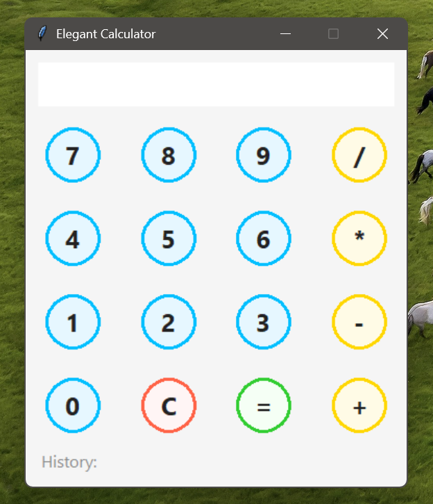

# 🧮 Python Calculator
A simple Python-based calculator to perform basic mathematical operations.

## ✨ Features
- Addition, Subtraction, Multiplication, and Division.
- Clean and simple command-line interface.



## 🚀 How to Run
Make sure you have Python installed, then run:
```bash
python main.py
